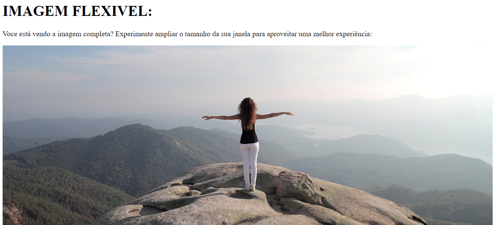

# IMAGEM FLEXIVEL
👨‍🏫PROJETO FEITO PARA O CURSO DE HTML E CSS DO CURSO EM VIDEO.

  

## DESCRIÇÃO:
O projeto "Imagem Flexível" oferece uma experiência adaptável de visualização de imagens, permitindo que os usuários desfrutem de uma visualização completa em diferentes tamanhos de tela. Aqui estão os recursos principais do projeto:

- **Imagem Responsiva:**
  - A imagem se ajusta dinamicamente ao tamanho da janela do navegador, garantindo uma visualização ideal em diferentes dispositivos e tamanhos de tela.

## EXECUTANDO O PROJETO:
1. Abra o arquivo `CODIGO.html` em um navegador da web.
2. Amplie ou reduza o tamanho da janela do navegador para observar a adaptação da imagem.
3. Experimente diferentes tamanhos de tela para verificar a flexibilidade da imagem.

## NÃO SABE?
- Entendemos que para manipular arquivos em `HTML`, `CSS` e outras linguagens relacionadas, é necessário possuir conhecimento nessas áreas. Para auxiliar nesse aprendizado, oferecemos cursos gratuitos disponíveis:
* [CURSO DE HTML E CSS](https://github.com/VILHALVA/CURSO-DE-HTML-E-CSS)
* [CURSO DE JAVASCRIPT](https://github.com/VILHALVA/CURSO-DE-JAVASCRIPT)
* [CONFIRA MAIS CURSOS](https://github.com/VILHALVA?tab=repositories&q=+topic:CURSO)

## CREDITOS:
- [PROJETO FEITO PELO VILHALVA](https://github.com/VILHALVA)
- [PROJETO FEITO PARA O CURSO DE HTML E CSS](https://github.com/VILHALVA/CURSO-DE-HTML-E-CSS)
